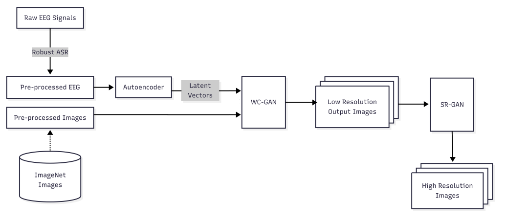
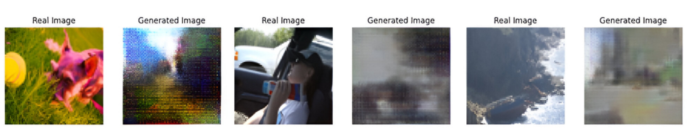

dataset for eeg-image can be accessed at  
https://www.mindbigdata.com/opendb/imagenet.html
images: https://www.kaggle.com/c/imagenet-object-localization-challenge/data

## EEG-to-Image: Brief Status Note

 ### What is completed

 - EEG data from the **MindBigData ImageNet EEG dataset** has been acquired and preprocessed.
- An **autoencoder-based preprocessing stage** was used for denoising and dimensionality reduction.
- A **transformer-based encoder** was designed to extract meaningful temporal EEG representations.
- A **Wasserstein Conditional GAN (WCGAN)** was implemented for EEG-to-image reconstruction.
- The generator maps EEG representations to images, while the discriminator distinguishes generated images from real images.
- The pipeline was evaluated using **SSIM, MSE, and Inception Score**.
- Reported results:
  - **SSIM:** 0.18
  - **MSE:** 0.1142
  - **Inception Score:** 1.986
- Qualitative results show preservation of **dominant colors, object placement, coarse structure, and general spatial layout**.

 ### What is pending

 - Improve the reconstruction beyond coarse/low-detail images.
- Perform more extensive experiments across different subjects and EEG recordings.
- Validate **subject-independent generalization**.
- Compare WCGAN performance against stronger generative approaches such as diffusion models.
- Conduct systematic ablation studies for the transformer, autoencoder, and GAN components.
- Evaluate the pipeline under more realistic **real-time BCI conditions**.
- Conduct user-level validation to determine whether reconstructed images are actually useful for communication by people with LiS.

 ### Known issues

 - **Low image fidelity:** SSIM of 0.18 indicates limited structural similarity to the original images.
- **Blurring and loss of fine details:** textures, edges, and high-frequency visual information are difficult to reconstruct from EEG.
- **Subject variability:** EEG patterns differ substantially between individuals, reducing cross-subject performance.
- **Low signal-to-noise ratio:** EEG contains artifacts and relatively weak task-related neural information.
- **Limited semantic precision:** the model can capture the general _gist_ of an image but may not reliably recover specific visual details.
- **Dataset limitations:** recordings collected under controlled visual-stimulus conditions may not fully represent real-world communication scenarios.

 ### Possible future enhancements

 - Use **EEG-specific self-supervised or contrastive pretraining** to learn more robust neural representations.
- Replace or augment WCGAN with **latent diffusion or conditional diffusion models** for higher-quality reconstruction.
- Incorporate **CLIP/vision-language embeddings** to improve semantic consistency between EEG representations and generated images.
- Use **attention mechanisms and temporal-frequency features** to better exploit EEG information.
- Develop **subject-adaptive/few-shot calibration** methods to reduce inter-subject variability.
- Explore **multimodal fusion of EEG and fMRI** so EEG provides temporal information while fMRI provides richer spatial information.
- Optimize the model for **low-latency inference**, enabling practical near-real-time visual communication.
- Introduce **confidence estimation** so the system can indicate when a reconstructed image is unreliable rather than presenting an incorrect image as certain.

 **In summary:** the EEG-to-Image pipeline is currently a **proof-of-concept that successfully extracts coarse visual information from EEG**, but its main remaining challenge is improving image fidelity, subject generalization, and real-world usability.